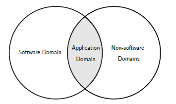

# 操作系统从0到1
这个仓库就是想自己做一个操作系统试试，把[Operating_Systems_From_0_to_1](https://github.com/tuhdo/os01/blob/master/Operating_Systems_From_0_to_1.pdf)看一遍看看自己是否能够做出一个操作系统，二话不说，先把书翻译一遍，自己先理解下。

## 文档范围
1. 问题领域
- 在现实世界中，软件工程不仅关注于软件，而且是它试图解决的问题领域。
```
一个问题领域是世界的一部分，在那里，计算机将直接或间接地产生效果，以及产生效果的可用手段。（科维茨，1999）
```
- 问题域是软件工程师需要理解的编程之外的任何东西，以便生成能够达到预期效果的正确代码。“直接”是指软件可以控制以产生所需效果的任何东西，例如键盘、打印机、监视器、其他软件等。“间接”是指与问题域无关的任何东西，例如当发生某个事件时软件通知的适当人员，学生根据软件生成的时间表移动到正确的教室。要编写一个财务应用程序，软件工程师需要学习足够的财务概念来理解客户的需求并正确地实现这些需求。
```
需求是机器通过编程在问题领域发挥的作用。
```
- 单独编程并不太复杂；解决问题域的编程是1.软件工程师不仅需要了解如何实现软件，还需要了解它试图解决的问题领域，这可能需要深入的专家知识。软件工程师还必须选择适用于他试图解决的问题领域的正确编程技术，因为在一个领域有效的许多技术可能不在另一个领域。例如，许多类型的应用程序不需要编写高性能的代码，而是需要很短的上市时间。在这种情况下，解释语言之所以广受欢迎，是因为它能够满足这种需要。然而，对于编写大型3D游戏或操作系统，编译语言占主导地位，因为它可以生成此类应用程序所需的最有效的代码。
- 通常，对于软件工程师来说，学习非琐碎的任务太多了（这可能需要学士或以上学位才能理解这些领域）。而且，对于领域专家来说，学习足够多的程序来将问题领域分解成足够小的部分供软件工程师实现更容易。有时，领域专家自己实现软件。



- 这类场景的一个例子是本书中介绍的域：操作系统。实现一个操作系统需要一定的电气工程（EE）知识。如果计算机科学（CS）课程不包括最低的EE课程，则该课程中的学生几乎没有机会实现操作系统。即使他们可以实现一个，要么他们需要投入大量的时间来自己研究，要么他们在预定义的框架中填充代码来理解高级算法。因此，EE学生更容易实现操作系统，因为他们只需要学习一些核心的CS课程。实际上，只有“C编程”和“算法和数据结构”类通常足以让它们开始为设备驱动程序编写代码，然后将其推广到操作系统中。


- 需要注意的是，软件是它自己的问题领域。问题域不一定在软件和自身之间划分。编译器、三维图形、游戏、密码学、人工智能等都是软件工程领域的一部分（实际上它更多的是计算机科学领域而不是软件工程领域）。一般来说，软件专用域创建供其他软件使用的软件。操作系统也是一个域，但与其他域（如电气工程）重叠。为了有效地实现一个操作系统，需要对外部域有足够的了解。对于一个软件工程师来说，有多少知识是足够的？软件工程师至少应该有足够的知识来理解硬件工程师为使用（即编程）他们的设备而准备的文件。
- 学习一门编程语言，甚至是C语言或汇编语言，并不意味着软件工程师能够自动地擅长硬件编程或任何相关的低级编程领域。一个人可以花10年、20年或者他的一生写C/C++代码，而他仍然不能写操作系统，仅仅是因为对相关领域知识的无知。就像学习英语并不意味着一个人会自动地阅读用英语写的数学书一样。需要的远不止这些。仅仅知道一两种编程语言是不够的。如果一个程序员以写软件为生，如果他不想让那些在业余时间学习编程的领域专家来承担他的工作，他肯定会在软件之外的一到两个问题领域专攻。

2. 实现问题域的文档
- 文档对于学习问题领域（实际上是任何领域）是必不可少的，因为信息可以可靠地传递。很明显，这篇书面文本已经被使用了几千年，以代代相传的知识。文档是非平凡项目的组成部分。没有文件：
    + 新来的人会发现加入一个项目要困难得多。
    + 维护一个项目比较困难，因为人们可能会忘记系统中重要的未解决的错误或怪癖。
    + 对顾客来说，理解他们要使用的产品是一项挑战。但是，文件不需要以书本的形式书写。它可以是任何形式，从HTML格式到数据库格式，都可以通过图形用户界面显示。重要信息必须存放在安全、容易获取的地方。
- 有许多类型的文件。然而，为了便于问题域的理解，需要编写这两个文档：软件需求文档和软件规范。
- 软件需求文档包括需求列表和问题域描述（Kovitz，1999）
- 软件解决了业务问题。但是，哪些问题需要解决，是客户要求的。其中许多请求列出了我们的软件需要满足的需求。然而，枚举的特性列表在交付软件时很少有用。如所述软件需求前一节，棘手的部分不是单独编程，而是根据问题域编程。软件设计和实现的大部分依赖于问题领域的知识。对领域的理解越深入，软件的质量就越高。比如，建房是几千年来的实践，大家都很了解，建一栋高质量的房子很容易；软件也不例外。很难理解的代码通常是由于作者对问题域的无知。在这本书中，我们试图了解各种硬件设备的底层工作。
- 由于软件质量取决于对问题域的理解，因此软件需求文档的数量应与问题域描述一致。
- 请注意，软件需求不是：
    + 什么和怎样是模糊的术语。什么是“什么”？只是名词吗？如果是的话，如果一个客户要求他的软件按照特定的操作步骤进行操作，比如在一个网站上为一个客户购买程序。现在包括动词吗？然而，“怎么做”不应该是一步一步的操作吗？任何东西都可以是“什么”，任何东西都可以是“如何”。
    + 草图软件需求文档主要是关于问题的。它不应该是对实现的高级描述。有些问题似乎很容易从域描述直接映射到实现的结构。例如：
        * 用户可以在**下拉菜单**中选择书籍列表。
        * 书籍存储在一个**链表**中。
        * 等等
    + 将来，所有的书都会以缩略图的形式直接列在一个页面上，而不是一个下拉菜单。书籍可能被重新实现为一个图形，每个节点都是一本查找相关书籍的书籍，因为下一个版本中将添加一个推荐程序。需求文档需要再次更新以删除所有过时的实现细节，因此需要额外的工作来维护需求文档，当与实现同步的工作太多时，开发人员放弃文档，每个人都开始抱怨文档是多么的无用
    + 通常没有直接的一对一映射。例如，一个普通的计算机用户希望一个操作系统能够运行一些带有GUI的程序，或者他们最喜欢的计算机游戏。但是对于这样的需求，操作系统被实现为多个层次，每个层次都隐藏上层的细节。要实现一个操作系统，需要来自多个领域的大量知识，特别是当操作系统运行在非PC设备上时。
    + 最好在需求文档中包含与问题域相关的信息。测试需求文档质量的一个好方法是将其提供给领域专家进行校对，以确保他能够彻底理解材料。需求文档在以后用作帮助文档或更容易编写帮助文档时也很有用。
- 软件规范文档说明了输出设备的期望行为与输入设备的所有可能行为相关的规则，以及问题域的其他部分必须遵守的任何规则
- 简单地说，软件规范是接口设计，对问题域有限制，例如，软件可以接受某些类型的输入，例如，软件被设计为接受英语，但不接受其他语言。对于硬件设备，总是需要一个规范，因为软件依赖于它的硬连接行为。事实上，大多数情况下，硬件规范都定义得很好，其中包含的细节很少。它必须是这样的，因为一旦硬件在物理上被人剥削，就没有回头路，如果存在缺陷，这对公司在财务和声誉上都是毁灭性的破坏。
- 注意，与需求文档类似，规范只涉及接口设计。如果实现细节泄漏，那么在实际实现和规范之间同步是一个负担，很快就会被放弃。
- 另一个重要的注意事项是，尽管规范文档很重要，但它不必在实现之前生成。它可以按任何顺序准备：在一个完整的实现之前或之后；或者在实现的同时，当某个部分完成时，接口准备好记录在规范中。不管方法如何，重要的是在最后要有一个完整的规范。

3. 用于编写x86操作系统的文档
- 当问题域不同于软件域时，需求文档和规范通常是分离的。然而，如果问题域在软件内部，则规范通常包括两者，并且两者的内容可以相互混合。正如前面章节所展示的文档的重要性一样，要实现一个操作系统，我们需要收集相关文档以获得足够的领域知识。这些文件如下：
    + 英特尔64与IA-32体系结构软件开发人员手册（第1、2、3卷）
    + 英特尔3系列Express芯片组系列产品介绍
    + System V应用程序二进制接口
- 除了英特尔的官方网站外，本书的网站还提供了方便的文档（英特尔可能会在更新网站时更改指向文档的链接，因此本书不包含指向文档的任何链接，以避免读者混淆。）
- 英特尔文档清楚地划分了需求和规范部分，但使用不同的名称来调用这些部分。与需求文档相对应的是一个称为“功能描述”的部分，它主要由域描述组成；对于规范，“寄存器描述”部分描述所有编程接口。两个文档都没有不必要的实现细节（这些细节是商业机密）。如本章所述，Intel文档也是如何编写良好的需求/规范的好例子。
- 除英特尔文档外，其他文档将在相关章节中介绍。

## 从硬件到软件：抽象层
本章给出了硬件和软件是如何连接在一起的直觉，以及软件在物理上是如何表示的。

1. bit的物理实现
- 所有的电子设备，从简单到复杂，都会操纵这个流程，在现实世界中达到预期的效果。计算机也不例外。当我们编写软件时，我们间接地在物理层操纵电流，这样底层机器就能产生预期的效果。为了理解这个过程，我们考虑一个简单的灯泡。灯泡可以通过开关在开和关之间改变两种状态：关表示0，开表示1。
- 然而，一个问题是这样的开关需要人工干预。所需的是基于上述电压水平的自动开关。为了实现电信号的自动切换，威廉·肖克利、约翰·巴丁和沃尔特·布拉坦发明了一种叫做晶体管的装置。这项发明开创了整个计算机工业。
- 它的核心，晶体管只是一个电阻，其值可以根据输入电压值而变化。
- 有了这个特性，晶体管可以用作电流放大器（更高的电压，更少的电阻）或根据电压水平关闭和打开电信号（阻止和疏通电子流）。在0伏电压下，没有电流可以通过晶体管，因此它就像一个开关断开（灯泡熄灭）的电路，因为电阻值足以阻挡电流。类似地，在+3.5V时，电流可以流过晶体管，因为电阻值减小，有效地使电子流动，从而起到闭合开关电路的作用。
- 位有两种状态：0和1，这是所有数字系统和软件的组成部分。与可以打开和关闭的灯泡类似，bits是从电源的电流中产生的：bit 0表示为0V（无电子流），bit 1表示为+3.5V到+5V（电子流）。晶体管实现的bit是正确的，因为它可以根据电压水平调节电子流。


- 如果你想更深入地了解晶体管电子的运动，你应该看看Youtube上本·埃特的视频“半导体是如何工作的”。

- 经典晶体管的发明开创了微型数字器件的全新世界。在这项发明之前，真空管——这只是一种更奇特的灯泡——被用来呈现0和1，并要求人类打开和关闭它。MOSFET，或金属氧化物半导体场效应晶体管，是由贝尔实验室的Dawon Kahng和Martin M.（John）AtLa在1959发明的，是一种更适合数字器件的改进型晶体管，因为它需要更短的开关状态在两个状态0和1之间，更稳定，耗电少，生产容易。
- 还有两种类型的MOSFET类似于两种晶体管：n-MOSFET和p-MOSFET。n-MOSFET和p-MOSFET简称NMOS和PMOS晶体管。

2. 超越晶体管：数字逻辑阀门
- 所有的数字设备都是用逻辑阀门设计的。逻辑阀门是实现布尔函数的设备。每个逻辑门包括多个输入和一个输出。所有的计算机操作都是由逻辑阀门组合而成的，逻辑阀门只是布尔函数的组合。


- 逻辑门只接受二进制输入（输入0或1）并产生二进制输出。换句话说，逻辑门是转换二进制值的函数。幸运的是，一个数学分支专门处理已经存在的二进制值，称为布尔代数，由乔治·布尔开发于19世纪。以完善的数学理论为基础，建立了逻辑门。当逻辑门实现布尔函数时，一组布尔函数在功能上是完整的，如果这组布尔函数可以构造所有其他布尔函数。后来，Charles Sanders-Peirce（1880-1881）证明了或非门或与非门的布尔函数足以创建所有其他布尔逻辑函数。因此，或非门和与非门在功能上是完全的（Peirce（1933））。门只是布尔逻辑函数的实现，因此与非门或或非门足以实现所有其他逻辑门。最简单的栅CMOS电路可以实现的是反相器（而不是栅）和从反相器来的与非门。有了与非门，我们有信心实现其他一切。这就是为什么晶体管的发明，然后CMOS电路革命了计算机工业。
- 我们应该认识到并理解布尔函数在所有编程语言中是多么强大。
- 每一个逻辑门的底层都是一个叫做CMOS互补CMOS MOSFET的电路。CMOS由两个互补晶体管NMOS和PMOS组成。最简单的CMOS电路是逆变器或非门：


-从非门可以创建与非门：


- 从与非门，我们有所有其他的门。如图所示，这种简单的电路以日常程序语言执行逻辑运算符，例如NOT operator~由逆变电路直接执行，operator&由and电路等执行。代码不会在魔法黑匣子上运行。相比之下，代码执行是精确和透明的，通常就像运行一些硬接线电路一样简单。当我们编写软件时，我们只是在物理层操纵电流来运行适当的电路来产生预期的结果。然而，这整个过程不知何故与任何涉及电流的思想无关。这才是真正的魔法，很快就会被解释。
- CMOS的一个有趣的特性是k输入栅极使用k个PMOS和k个NMOS晶体管（Wakerly，1999）。所有的逻辑门都是由成对的NMOS和PMOS晶体管构成的，门是从简单到复杂的所有数字器件的组成部分，包括任何计算机。由于这种模式，可以在实际的物理电路实现和逻辑实现之间进行分离。数字设计是通过逻辑门进行设计，然后“编译”成物理电路。事实上，稍后我们将看到逻辑门成为描述电路如何工作的语言。了解CMOS的工作原理对于理解计算机是如何设计的，以及计算机是如何工作的非常重要。
- 最后，一个带有导线和晶体管的实现电路被物理地存储在一个叫做芯片的包中。芯片是集成电路蚀刻在其上的基板。然而，芯片也指在消费市场上完全封装的集成电路。根据上下文的不同，对它的理解也不同。


- 上图74HC00是一个有四个2输入与非门的芯片。该芯片配有8个输入引脚和4个输出引脚，1个引脚用于连接电压源，1个引脚用于连接接地。这个设备是与非门的物理实现，我们可以物理地触摸和使用。但是，芯片不只是一个门，而是配备了4个可以组合的门。每种组合都能实现不同的逻辑功能，有效地创建其他逻辑门。这个特性使得芯片很受欢迎。
- 如前所述，上面的每一个栅极都只是一个简单的带电子流的与非门电路。然而，许多这些与非门芯片结合起来就可以构成一台简单的计算机。在物理层面上，软件只是电子流。


- 如何使用74HC00创建上述门？很简单：由于每个与非门都有2个输入管脚和1个输出管脚，我们可以将1个与非门的输出写入另一个与非门的输入，从而将与非门链接在一起，生成如上所示的图。

3. 超越逻辑门：机器语言
