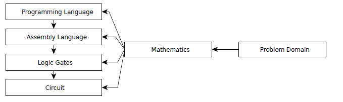

# 操作系统从0到1
这个仓库就是想自己做一个操作系统试试，把[Operating_Systems_From_0_to_1](https://github.com/tuhdo/os01/blob/master/Operating_Systems_From_0_to_1.pdf)看一遍看看自己是否能够做出一个操作系统，二话不说，先把书翻译一遍，自己先理解下。

## 文档范围
1. 问题领域
- 在现实世界中，软件工程不仅关注于软件，而且是它试图解决的问题领域。
```
一个问题领域是世界的一部分，在那里，计算机将直接或间接地产生效果，以及产生效果的可用手段。（科维茨，1999）
```
- 问题域是软件工程师需要理解的编程之外的任何东西，以便生成能够达到预期效果的正确代码。“直接”是指软件可以控制以产生所需效果的任何东西，例如键盘、打印机、监视器、其他软件等。“间接”是指与问题域无关的任何东西，例如当发生某个事件时软件通知的适当人员，学生根据软件生成的时间表移动到正确的教室。要编写一个财务应用程序，软件工程师需要学习足够的财务概念来理解客户的需求并正确地实现这些需求。
```
需求是机器通过编程在问题领域发挥的作用。
```
- 单独编程并不太复杂；解决问题域的编程是1.软件工程师不仅需要了解如何实现软件，还需要了解它试图解决的问题领域，这可能需要深入的专家知识。软件工程师还必须选择适用于他试图解决的问题领域的正确编程技术，因为在一个领域有效的许多技术可能不在另一个领域。例如，许多类型的应用程序不需要编写高性能的代码，而是需要很短的上市时间。在这种情况下，解释语言之所以广受欢迎，是因为它能够满足这种需要。然而，对于编写大型3D游戏或操作系统，编译语言占主导地位，因为它可以生成此类应用程序所需的最有效的代码。
- 通常，对于软件工程师来说，学习非琐碎的任务太多了（这可能需要学士或以上学位才能理解这些领域）。而且，对于领域专家来说，学习足够多的程序来将问题领域分解成足够小的部分供软件工程师实现更容易。有时，领域专家自己实现软件。


- 这类场景的一个例子是本书中介绍的域：操作系统。实现一个操作系统需要一定的电气工程（EE）知识。如果计算机科学（CS）课程不包括最低的EE课程，则该课程中的学生几乎没有机会实现操作系统。即使他们可以实现一个，要么他们需要投入大量的时间来自己研究，要么他们在预定义的框架中填充代码来理解高级算法。因此，EE学生更容易实现操作系统，因为他们只需要学习一些核心的CS课程。实际上，只有“C编程”和“算法和数据结构”类通常足以让它们开始为设备驱动程序编写代码，然后将其推广到操作系统中。


- 需要注意的是，软件是它自己的问题领域。问题域不一定在软件和自身之间划分。编译器、三维图形、游戏、密码学、人工智能等都是软件工程领域的一部分（实际上它更多的是计算机科学领域而不是软件工程领域）。一般来说，软件专用域创建供其他软件使用的软件。操作系统也是一个域，但与其他域（如电气工程）重叠。为了有效地实现一个操作系统，需要对外部域有足够的了解。对于一个软件工程师来说，有多少知识是足够的？软件工程师至少应该有足够的知识来理解硬件工程师为使用（即编程）他们的设备而准备的文件。
- 学习一门编程语言，甚至是C语言或汇编语言，并不意味着软件工程师能够自动地擅长硬件编程或任何相关的低级编程领域。一个人可以花10年、20年或者他的一生写C/C++代码，而他仍然不能写操作系统，仅仅是因为对相关领域知识的无知。就像学习英语并不意味着一个人会自动地阅读用英语写的数学书一样。需要的远不止这些。仅仅知道一两种编程语言是不够的。如果一个程序员以写软件为生，如果他不想让那些在业余时间学习编程的领域专家来承担他的工作，他肯定会在软件之外的一到两个问题领域专攻。

2. 实现问题域的文档
- 文档对于学习问题领域（实际上是任何领域）是必不可少的，因为信息可以可靠地传递。很明显，这篇书面文本已经被使用了几千年，以代代相传的知识。文档是非平凡项目的组成部分。没有文件：
    + 新来的人会发现加入一个项目要困难得多。
    + 维护一个项目比较困难，因为人们可能会忘记系统中重要的未解决的错误或怪癖。
    + 对顾客来说，理解他们要使用的产品是一项挑战。但是，文件不需要以书本的形式书写。它可以是任何形式，从HTML格式到数据库格式，都可以通过图形用户界面显示。重要信息必须存放在安全、容易获取的地方。
- 有许多类型的文件。然而，为了便于问题域的理解，需要编写这两个文档：软件需求文档和软件规范。
- 软件需求文档包括需求列表和问题域描述（Kovitz，1999）
- 软件解决了业务问题。但是，哪些问题需要解决，是客户要求的。其中许多请求列出了我们的软件需要满足的需求。然而，枚举的特性列表在交付软件时很少有用。如所述软件需求前一节，棘手的部分不是单独编程，而是根据问题域编程。软件设计和实现的大部分依赖于问题领域的知识。对领域的理解越深入，软件的质量就越高。比如，建房是几千年来的实践，大家都很了解，建一栋高质量的房子很容易；软件也不例外。很难理解的代码通常是由于作者对问题域的无知。在这本书中，我们试图了解各种硬件设备的底层工作。
- 由于软件质量取决于对问题域的理解，因此软件需求文档的数量应与问题域描述一致。
- 请注意，软件需求不是：
    + 什么和怎样是模糊的术语。什么是“什么”？只是名词吗？如果是的话，如果一个客户要求他的软件按照特定的操作步骤进行操作，比如在一个网站上为一个客户购买程序。现在包括动词吗？然而，“怎么做”不应该是一步一步的操作吗？任何东西都可以是“什么”，任何东西都可以是“如何”。
    + 草图软件需求文档主要是关于问题的。它不应该是对实现的高级描述。有些问题似乎很容易从域描述直接映射到实现的结构。例如：
        * 用户可以在**下拉菜单**中选择书籍列表。
        * 书籍存储在一个**链表**中。
        * 等等
    + 将来，所有的书都会以缩略图的形式直接列在一个页面上，而不是一个下拉菜单。书籍可能被重新实现为一个图形，每个节点都是一本查找相关书籍的书籍，因为下一个版本中将添加一个推荐程序。需求文档需要再次更新以删除所有过时的实现细节，因此需要额外的工作来维护需求文档，当与实现同步的工作太多时，开发人员放弃文档，每个人都开始抱怨文档是多么的无用
    + 通常没有直接的一对一映射。例如，一个普通的计算机用户希望一个操作系统能够运行一些带有GUI的程序，或者他们最喜欢的计算机游戏。但是对于这样的需求，操作系统被实现为多个层次，每个层次都隐藏上层的细节。要实现一个操作系统，需要来自多个领域的大量知识，特别是当操作系统运行在非PC设备上时。
    + 最好在需求文档中包含与问题域相关的信息。测试需求文档质量的一个好方法是将其提供给领域专家进行校对，以确保他能够彻底理解材料。需求文档在以后用作帮助文档或更容易编写帮助文档时也很有用。
- 软件规范文档说明了输出设备的期望行为与输入设备的所有可能行为相关的规则，以及问题域的其他部分必须遵守的任何规则
- 简单地说，软件规范是接口设计，对问题域有限制，例如，软件可以接受某些类型的输入，例如，软件被设计为接受英语，但不接受其他语言。对于硬件设备，总是需要一个规范，因为软件依赖于它的硬连接行为。事实上，大多数情况下，硬件规范都定义得很好，其中包含的细节很少。它必须是这样的，因为一旦硬件在物理上被人剥削，就没有回头路，如果存在缺陷，这对公司在财务和声誉上都是毁灭性的破坏。
- 注意，与需求文档类似，规范只涉及接口设计。如果实现细节泄漏，那么在实际实现和规范之间同步是一个负担，很快就会被放弃。
- 另一个重要的注意事项是，尽管规范文档很重要，但它不必在实现之前生成。它可以按任何顺序准备：在一个完整的实现之前或之后；或者在实现的同时，当某个部分完成时，接口准备好记录在规范中。不管方法如何，重要的是在最后要有一个完整的规范。

3. 用于编写x86操作系统的文档
- 当问题域不同于软件域时，需求文档和规范通常是分离的。然而，如果问题域在软件内部，则规范通常包括两者，并且两者的内容可以相互混合。正如前面章节所展示的文档的重要性一样，要实现一个操作系统，我们需要收集相关文档以获得足够的领域知识。这些文件如下：
    + 英特尔64与IA-32体系结构软件开发人员手册（第1、2、3卷）
    + 英特尔3系列Express芯片组系列产品介绍
    + System V应用程序二进制接口
- 除了英特尔的官方网站外，本书的网站还提供了方便的文档（英特尔可能会在更新网站时更改指向文档的链接，因此本书不包含指向文档的任何链接，以避免读者混淆。）
- 英特尔文档清楚地划分了需求和规范部分，但使用不同的名称来调用这些部分。与需求文档相对应的是一个称为“功能描述”的部分，它主要由域描述组成；对于规范，“寄存器描述”部分描述所有编程接口。两个文档都没有不必要的实现细节（这些细节是商业机密）。如本章所述，Intel文档也是如何编写良好的需求/规范的好例子。
- 除英特尔文档外，其他文档将在相关章节中介绍。

## 从硬件到软件：抽象层
本章给出了硬件和软件是如何连接在一起的直觉，以及软件在物理上是如何表示的。

1. bit的物理实现
- 所有的电子设备，从简单到复杂，都会操纵这个流程，在现实世界中达到预期的效果。计算机也不例外。当我们编写软件时，我们间接地在物理层操纵电流，这样底层机器就能产生预期的效果。为了理解这个过程，我们考虑一个简单的灯泡。灯泡可以通过开关在开和关之间改变两种状态：关表示0，开表示1。
- 然而，一个问题是这样的开关需要人工干预。所需的是基于上述电压水平的自动开关。为了实现电信号的自动切换，威廉·肖克利、约翰·巴丁和沃尔特·布拉坦发明了一种叫做晶体管的装置。这项发明开创了整个计算机工业。
- 它的核心，晶体管只是一个电阻，其值可以根据输入电压值而变化。
- 有了这个特性，晶体管可以用作电流放大器（更高的电压，更少的电阻）或根据电压水平关闭和打开电信号（阻止和疏通电子流）。在0伏电压下，没有电流可以通过晶体管，因此它就像一个开关断开（灯泡熄灭）的电路，因为电阻值足以阻挡电流。类似地，在+3.5V时，电流可以流过晶体管，因为电阻值减小，有效地使电子流动，从而起到闭合开关电路的作用。
- 位有两种状态：0和1，这是所有数字系统和软件的组成部分。与可以打开和关闭的灯泡类似，bits是从电源的电流中产生的：bit 0表示为0V（无电子流），bit 1表示为+3.5V到+5V（电子流）。晶体管实现的bit是正确的，因为它可以根据电压水平调节电子流。


- 如果你想更深入地了解晶体管电子的运动，你应该看看Youtube上本·埃特的视频“半导体是如何工作的”。

- 经典晶体管的发明开创了微型数字器件的全新世界。在这项发明之前，真空管——这只是一种更奇特的灯泡——被用来呈现0和1，并要求人类打开和关闭它。MOSFET，或金属氧化物半导体场效应晶体管，是由贝尔实验室的Dawon Kahng和Martin M.（John）AtLa在1959发明的，是一种更适合数字器件的改进型晶体管，因为它需要更短的开关状态在两个状态0和1之间，更稳定，耗电少，生产容易。
- 还有两种类型的MOSFET类似于两种晶体管：n-MOSFET和p-MOSFET。n-MOSFET和p-MOSFET简称NMOS和PMOS晶体管。

2. 超越晶体管：数字逻辑阀门
- 所有的数字设备都是用逻辑阀门设计的。逻辑阀门是实现布尔函数的设备。每个逻辑门包括多个输入和一个输出。所有的计算机操作都是由逻辑阀门组合而成的，逻辑阀门只是布尔函数的组合。


- 逻辑门只接受二进制输入（输入0或1）并产生二进制输出。换句话说，逻辑门是转换二进制值的函数。幸运的是，一个数学分支专门处理已经存在的二进制值，称为布尔代数，由乔治·布尔开发于19世纪。以完善的数学理论为基础，建立了逻辑门。当逻辑门实现布尔函数时，一组布尔函数在功能上是完整的，如果这组布尔函数可以构造所有其他布尔函数。后来，Charles Sanders-Peirce（1880-1881）证明了或非门或与非门的布尔函数足以创建所有其他布尔逻辑函数。因此，或非门和与非门在功能上是完全的（Peirce（1933））。门只是布尔逻辑函数的实现，因此与非门或或非门足以实现所有其他逻辑门。最简单的栅CMOS电路可以实现的是反相器（而不是栅）和从反相器来的与非门。有了与非门，我们有信心实现其他一切。这就是为什么晶体管的发明，然后CMOS电路革命了计算机工业。
- 我们应该认识到并理解布尔函数在所有编程语言中是多么强大。
- 每一个逻辑门的底层都是一个叫做CMOS互补CMOS MOSFET的电路。CMOS由两个互补晶体管NMOS和PMOS组成。最简单的CMOS电路是逆变器或非门：


-从非门可以创建与非门：


- 从与非门，我们有所有其他的门。如图所示，这种简单的电路以日常程序语言执行逻辑运算符，例如NOT operator~由逆变电路直接执行，operator&由and电路等执行。代码不会在魔法黑匣子上运行。相比之下，代码执行是精确和透明的，通常就像运行一些硬接线电路一样简单。当我们编写软件时，我们只是在物理层操纵电流来运行适当的电路来产生预期的结果。然而，这整个过程不知何故与任何涉及电流的思想无关。这才是真正的魔法，很快就会被解释。
- CMOS的一个有趣的特性是k输入栅极使用k个PMOS和k个NMOS晶体管（Wakerly，1999）。所有的逻辑门都是由成对的NMOS和PMOS晶体管构成的，门是从简单到复杂的所有数字器件的组成部分，包括任何计算机。由于这种模式，可以在实际的物理电路实现和逻辑实现之间进行分离。数字设计是通过逻辑门进行设计，然后“编译”成物理电路。事实上，稍后我们将看到逻辑门成为描述电路如何工作的语言。了解CMOS的工作原理对于理解计算机是如何设计的，以及计算机是如何工作的非常重要。
- 最后，一个带有导线和晶体管的实现电路被物理地存储在一个叫做芯片的包中。芯片是集成电路蚀刻在其上的基板。然而，芯片也指在消费市场上完全封装的集成电路。根据上下文的不同，对它的理解也不同。


- 上图`74HC00`是一个有四个2输入与非门的芯片。该芯片配有8个输入引脚和4个输出引脚，1个引脚用于连接电压源，1个引脚用于连接接地。这个设备是与非门的物理实现，我们可以物理地触摸和使用。但是，芯片不只是一个门，而是配备了4个可以组合的门。每种组合都能实现不同的逻辑功能，有效地创建其他逻辑门。这个特性使得芯片很受欢迎。
- 如前所述，上面的每一个栅极都只是一个简单的带电子流的与非门电路。然而，许多这些与非门芯片结合起来就可以构成一台简单的计算机。在物理层面上，软件只是电子流。


- 如何使用74HC00创建上述门？很简单：由于每个与非门都有2个输入管脚和1个输出管脚，我们可以将1个与非门的输出写入另一个与非门的输入，从而将与非门链接在一起，生成如上所示的图。

3. 超越逻辑门：机器语言
- 由于建立在门上的门只接受0和1的序列，所以硬件设备只能理解0和1。然而，一个设备在系统上只接受0和1。机器语言是设备可以识别并执行相应操作的唯一位模式的集合。机器指令是设备可以识别的唯一位模式。在计算机系统中，具有其语言的设备称为CPU中央处理单元，它控制计算机内部的所有活动。例如，在在x86体系结构中，模式10100000意味着告诉CPU添加两个数字，或者000000101来停止计算机。在计算机的早期，人们必须完全用二进制来写。
- 为什么这样的位模式会导致设备执行某些操作？原因是每条指令的底层都是一个实现指令的小电路。与计算机程序中的函数/子程序如何通过其名称调用类似，位模式是CPU中的一个小函数的名称，当CPU找到一个小函数时，它就被执行。
- 请注意，CPU并不是唯一使用其语言的设备。CPU只是一个名称，用来表示控制计算机系统的硬件设备。硬件设备可能不是CPU，但仍有其语言。具有自己机器语言的设备是可编程设备，因为用户可以使用该语言命令设备执行不同的操作。例如，打印机有一组命令来指示它如何打印页面。
- 例2.3.1。用户可以在不知道74HC00芯片内部的情况下使用该芯片，但只能使用该设备的接口。首先，我们需要知道它的布局：


符号 | 针脚 | 说明
-|-|-
1A to 4A | 1, 4, 9, 12 | 数据输入
1B to 4B | 2, 5, 10, 13 | 数据输入
1Y to 4Y | 3, 6, 8, 11 | 数据输出
GND | 7 | 接地（0V）
Vcc | 14 | 供电电压

- 最后，如何使用针脚：

<table>
    <tr>
        <th colspan="2">输入</th>
        <th>输出</th>
    </tr>
    <tr>
        <th>nA</th>
        <th>nB</th>
        <th>nY</th>
    </tr>
    <tr>
        <td>L</td>
        <td>X</td>
        <td>H</td>
    </tr>
    <tr>
        <td>X</td>
        <td>L</td>
        <td>H</td>
    </tr>
    <tr>
        <td>H</td>
        <td>H</td>
        <td>L</td>
    </tr>
</table>

- n是一个数字，1、2、3或4
- H=高电压等级；L=低电压等级；X=无所谓。

- 功能描述提供了一个包含所有可能的管脚输入和输出的真值表，该真值表还描述了设备中所有管脚的使用情况。用户不需要知道实现，而需要在这样的表上使用设备。我们可以说上面的真值表是设备的机器语言。由于设备是数字的，因此其语言是二进制字符串的集合：
    + 这个设备有8个输入管脚，这意味着它接受8位的二进制字符串。
    + 该设备有4个输出管脚，这意味着它从8位输入产生4位二进制字符串。
- 输入字符串的数量是设备能够理解的，输出字符串的数量是设备能够说的。它们共同创造了设备的语言。尽管这个设备很简单，但是它可以接受的语言包含很多二进制字符串：28+24=272。然而，这个数字只是一个复杂设备的一小部分，比如一个有数百个管脚的CPU。
- 当保持原样时，`74HC00`只是一个与非门设备，有两个4位输入（或简单的4位与非门，因为它只能接受4位输入的最大值）。
- 示例2.3.1
<table>
    <tr>
        <th></th>
        <th colspan="8">输入</th>
        <th colspan="4">输出</th>
    </tr>
    <tr>
        <th>针脚</th>
        <th>1A</th>
        <th>1B</th>
        <th>2A</th>
        <th>2B</th>
        <th>3A</th>
        <th>3B</th>
        <th>4A</th>
        <th>4B</th>
        <th>1Y</th>
        <th>2Y</th>
        <th>3Y</th>
        <th>4Y</th>
    </tr>
    <tr>
        <th>值</th>
        <th>1</th>
        <th>1</th>
        <th>0</th>
        <th>0</th>
        <th>1</th>
        <th>1</th>
        <th>0</th>
        <th>0</th>
        <th>0</th>
        <th>1</th>
        <th>0</th>
        <th>1</th>
    </tr>
</table>

- 视觉呈现的输入和输出：


- 另一方面，如果或门被实现，我们只能从`74HC00`构建一个2输入OR门，因为它需要3个与或门：2个输入与或门和1个输出与或门。每个输入与或门仅代表或门的1位输入。在下图中，每个输入与非门的管脚总是设置为相同的值（两个输入为A或两个输入均为B），以表示最终或门的单个位输入：

- （a）2位或门逻辑图，由3个与非门和4个管脚构成，仅用于2位输入。


- （b）针脚3A和3B取1Y和2Y的值。


- 为了实现一个4位或门，我们需要总共4个74HC00芯片配置为或门，封装为一个芯片，如图所示。


- 汇编语言是二进制机器代码的符号表示，通过给出位模式的助记符名称。当程序员必须编写0和1时，这是一个巨大的改进。例如，程序员只需编写hlt来停止计算机，而不是编写000000101。这样的抽象使得CPU执行的指令更容易记住，因此可以记住更多的指令，查找CPU手册以找到位形式的指令所花费的时间更少，因此，代码编写得更快。
- 理解汇编语言对于低级编程领域来说是至关重要的，即使到了今天。程序员想要理解的指令越多，就需要对机器体系结构有更深的理解。
- 例2.3.2。我们可以使用两个组装说明来构建设备：
    + 或门接受两个4位操作数。这相当于一个由4个74HC00芯片构成的4输入或栅极装置。
    + 与非门接受两个4位操作数。这相当于一个74HC00芯片，保持原样。
```
或门 <op1>, <op2>
与非门 <op1>, <op2>
```
- 从本质上讲，示例2.3.1中的门实现了这些指令。到目前为止，我们只指定输入和输出，并手动将其馈送到设备。也就是说，要执行操作：
    + 用手挑选一个设备。
    + 手动将电信号输入引脚。

- 首先，我们希望自动化设备选择过程。也就是说，我们只想编写汇编指令，并且正确地选择了实现该指令的设备。解决这个问题很容易：
    + 给每条指令一个二进制代码索引，简称为操作码或操作码，并将其作为输入的一部分嵌入。每个指令的值如表2.3.4所示。

    指示 | 二进制码
    -|-
    与非门 | 00
    或门 | 01

    + 现在，每个输入在开头都包含额外的数据：操作码。例如，指令：
        + nand（与非门） 1100, 1100
    + 对应于二进制字符串：<font color=red>00</font>11001100。前两位00对与非门指令进行编码，如上表所示。

    + 根据指令特有的二进制代码添加另一个设备以选择设备

- 这种设备被称为解码器，它是CPU中决定使用哪种电路的重要部件。在上述示例中，当向解码器馈送0011001100时，由于操作码为00，数据被发送到与非门设备以进行计算。
- 最后，编写汇编代码只是一种更容易编写设备可以理解的二进制字符串的方法。当我们编写汇编代码并保存在文本文件中时，一个名为汇编程序的程序将文本文件汇编程序转换为设备可以理解的二进制字符串。那么，如何才能存在一个地方呢？假设这是世界上第一个汇编程序，那么它是用二进制代码编写的。在下一个版本中，生活更简单：程序员用汇编代码编写汇编程序，然后使用第一个版本编译自己。然后，这些二进制字符串存储在另一个设备中，稍后可以检索并发送到解码器。存储设备是存储机器指令的设备，它是用于保存0和1状态的电路阵列。
- 译码器是由类似于其他数字设备的逻辑门构成的。但是，存储设备可以是任何可以存储0和1且可检索的设备。存储设备可以是使用磁性来存储信息的磁化设备，也可以由在施加电压时可以改变和重新构成状态的电路构成。无论使用何种技术，只要设备能够存储数据并能够访问以检索数据，就足够了。事实上，现代设备是如此复杂，以至于不可能也不必要理解每一个实现细节。相反，我们只需要学习设备公开的接口，例如针脚。

- 解码器检索箭头所指的当前指令，并选择NAND（与非门）设备来执行NAND（与非门）指令。


- 计算机基本上实现了这个过程：
    + 从存储设备获取指令。
    + 解码指令。
    + 执行指令。
- 或者简而言之，一个获取-解码-执行周期。上面的设备是非常初级的，但它已经代表了一台具有取回-解码-执行周期的计算机。通过添加更多的设备和为指令分配更多的操作码，然后相应地更新解码器，可以实现更多的指令。阿波罗导航计算机是1961-1972年为阿波罗太空计划生产的一种数字计算机，它完全是用异或门建造的，异或门是与非门的另一种选择，用于创建其他逻辑门。同样，如果我们不断改进我们的假设设备，它最终会成为一台成熟的计算机。
- 汇编语言是编写0和1的一个进步。随着时间的推移，人们意识到许多汇编代码具有重复的使用模式。如果我们不在所有地方重复编写所有重复的代码块，而只是简单地使用更易于使用的文本表单来引用这些代码块，那就太好了。例如，一个汇编代码块检查一个变量是否大于另一个变量，如果大于，则执行一个代码块，否则执行另一个代码块；在C中，该汇编代码块由一个接近人类语言的if语句表示。


- 人们创建文本表单来表示通用的汇编代码块，比如上面的if语法，然后编写一个程序将文本表单转换为汇编代码。将这些文本形式转换为机器代码的程序称为编译器：


- 编程语言可以实现任何软件逻辑，硬件也可以实现。反之亦然：在电路中实现的任何硬件逻辑都可以用编程语言重新实现。原因很简单，编程语言、汇编语言、机器语言或逻辑门只是用来表达计算的语言。软件不可能实现硬件无法实现的功能，因为编程语言只是使用底层硬件的一种简单方法。最后，编程语言被翻译成对CPU有效的机器指令。否则，代码无法运行，因此是一个无用的软件。相反，软件可以做任何硬件（运行软件）可以做的事情，因为编程语言只是一种更容易使用硬件的方式。
- 事实上，尽管所有的语言在能力上都是等价的，但并不是所有的语言都能表达彼此的程序。编程语言在谱的两端有所不同：高级和低级。
- 编程语言的层次越高，与硬件的距离就越远。在一些高级编程语言（如Python）中，程序员不能操作底层硬件，尽管能够提供与低级编程语言相同的计算。原因是高级语言希望隐藏硬件细节，以使程序员免于处理与当前问题域无关的不相关细节。然而，这种便利性并非免费的：它需要软件携带一个额外的代码来管理硬件细节（例如内存），从而使代码运行速度变慢，并且它使硬件编程变得困难或不可能。编程语言的抽象性越强，编写底层软件（如硬件驱动程序或操作系统）就越困难。这就是为什么C语言通常是编写操作系统的首选语言，因为C只是底层硬件的一个薄薄包装，使得在执行某段C代码时很容易理解硬件设备是如何运行的。
- 每种编程语言都代表着一种思考程序的方式。高级编程语言有助于将重点放在与硬件完全无关的问题领域，而程序员的性能比计算机的性能更重要。低级编程语言有助于集中于机器的内部工作，因此最适合于与控制硬件相关的问题领域。这就是为什么有这么多语言存在的原因。为正确的工作使用正确的工具以获得最佳结果。

4. 抽象
- 抽象是一种隐藏与上下文中的问题无关的复杂性的技术。例如，编写除最低层以外没有任何其他层的程序：有电路。不仅一个人需要深入了解电路是如何工作的，这使得设计电路变得更加模糊，因为设计者必须看原始电路，而要从更高的层次思考，比如逻辑门。这是一个分散注意力的过程，因为设计师必须不断地将想法转化为电路。对于一个设计师来说，可能只是简单地把他的高层次的想法想清楚，然后再把这些想法转化成电路。它不仅效率更高，而且更准确，因为设计师可以集中所有精力用高层次的思维来验证设计。当新的设计者到达时，他可以很容易地理解高级设计，从而可以继续开发或维护现有的系统。
    1. 为什么抽象有效
    - 在所有层中，抽象都表现为：
        + 逻辑门抽象出CMOS的细节。
        + 机器语言抽象出逻辑门的细节。
        + 汇编语言抽象出机器语言的细节。
        + 编程语言抽象出汇编语言的细节。
    - 我们看到了下层如何构建上层的重复模式：
        + 下层有一个循环模式。然后，取出这个循环模式，并在其上构建一种语言。
        + 更高的一层去掉了特定于层的（非重复的）细节，以关注重复的细节。
        + 这些重复出现的细节被赋予了一种新的、比底层语言更简单的语言。
    - 需要认识到的是，每一层都只是一种更方便的语言来描述下层。只有在用上层语言完全创建描述之后，才能用下层语言实现描述。
        + CMOS层有一个循环模式，确保逻辑门可靠地转换成CMOS电路：k输入门使用k个PMOS和k个NMOS晶体管（Wakerly，1999）。由于数字设备只使用CMOS，所以出现了一种语言来描述隐藏CMOS电路时的更高层次的思想：逻辑门。
        + 逻辑门隐藏了电路的语言，着重于如何实现原始布尔函数，并将它们组合起来创建新函数。所有的逻辑门接收输入并产生二进制数输出。由于这种反复出现的模式，逻辑门被新语言程序集隐藏起来，程序集是一组预定义的二进制模式，它使底层的门执行一个操作。
        + 很快，人们意识到许多重复出现的模式都是从汇编语言中产生的。重复的程序集代码块出现在表达相同或相似思想的程序集源文件中。有许多这样的想法可以可靠地转换成汇编代码。因此，这些思想被提取出来，用于构建到当今每个程序员都学习的高级编程语言中。
        + 循环模式是抽象的关键。重复模式是抽象工作的原因。没有它们，就没有语言可以构建，因此也就没有抽象。幸运的是，人类已经发展出一门研究模式的系统学科：数学。引用英国数学家G.H.哈代（2005）的话：
            ```
            数学家，像画家或诗人一样，是图案的创造者。如果他的模式比他们的更持久，那是因为他们是由思想创造的。
            ```
        + 这不是一个数学公式，一个模式的代表吗？变量表示具有由约束给定的相同属性的值？数学提供了一个正式的系统来识别和描述自然界中存在的模式。基于这个原因，这个系统很可能应用于数字世界，而数字世界只是现实世界的一个子集。数学可以作为一种通用语言来帮助更容易地在层之间进行翻译，并有助于理解层。

        
    
    2. 抽象为何降低复杂性
    - 通过构建语言进行抽象当然可以通过剥离与问题无关的细节来利用生产力。想象一下，除了最底层的电路外，编写程序时没有任何其他布局。这就是复杂性是如何出现的：当高级概念用较低层次的语言来表达时，正如上面的例子所证明的。不幸的是，软件就是这样，因为目前编程语言更强调的是软件而不是问题领域。也就是说，如果没有先验知识，用一种语言编写的代码就无法表达其目标域的知识。换言之，如果一种语言的语法是为了表达它试图解决的问题领域而设计的，那么它就是有表现力的。考虑这个例子：也就是说，它将做什么，而不是如何做。

    - 例2.4.1。[Graphviz](http://www.Graphviz.org/)是一种可视化软件，它提供一种称为dot的语言，用于描述图形：

    

    - 可以看到，代码完美地表达了图与图之间的关系。有联系的。即使是非程序员也能很容易地理解和使用这种语言。在C中实现会更麻烦，这是假设用于绘制图形的函数已经可用。要画一条线，在C语言中我们可以写如下：
    ```C
    draw_line(a, b);
    ```
    - 但是，与以下内容相比，它仍然冗长：
    ```C
    a -> b;
    ```
    - 此外，与dot语言中的隐式节点相比，a和b必须用C语言定义。但是，如果我们不考虑细节，那么C语言仍然有一个限制：它不能改变语法以适应问题域。特定于域的语言可能更加冗长，但它使域更容易理解。如果一个问题域必须用C语言来表示，那么它就受到C语法的约束，因为C语言不是问题域的专用语言，而是一种通用的编程语言，所以领域知识被隐藏在实现细节中。因此，需要一个C程序员来破译和提取领域知识。如果无法提取领域知识，则无法进一步开发软件。
    - 例2.4.2。Linux中充满了由许多特定于领域的语言控制的应用程序，它们被放在/etc目录中，比如web服务器。而不是重新编程的软件，一个领域不可知的语言制造了它。
    - 一般来说，能够表示问题域的代码必须能被域专家理解。即使在软件领域中，用重复的编程模式构建语言也是有用的。它帮助人们意识到代码中存在这样的模式，从而使软件更易于维护，因为软件结构可视为语言。只有能够根据问题域进行变形的编程语言才能实现这一目标。这种语言被称为可编程语言。不幸的是，这种使软件结构可见的方法在程序员中并不受欢迎，因为必须用新的语言和新的工具链来支持它。因此，软件结构和领域知识隐藏在用通用语言的语法编写的代码中，如果程序员不熟悉或甚至意识到代码模式的存在，那么就无法理解代码。一个典型的例子是读取控制硬件的C代码，例如操作系统：如果程序员对硬件一无所知，那么即使他有20年的应用程序C代码的编写经验，也不可能用C来读写操作系统代码。
    - 通过抽象，软件工程师还可以理解设备的内部工作，而不需要专门的物理电路设计知识，使软件工程师能够编写控制设备的代码。逻辑实现和物理实现之间的分离还要求即使底层技术发生变化，也可以重用门设计。例如，在某些遥远的将来，生物计算机可能成为现实，而门可能不是以CMOS的形式实现，而是以某种生物细胞的形式实现，例如作为活细胞；在任何一种技术中：电的或生物的，只要逻辑门是物理实现的，就可以实现相同的计算机设计。

## 计算机体系结构
要编写低级代码，程序员必须了解计算机的体系结构。这与在软件框架中编写程序类似，他必须知道框架解决了什么样的问题，以及如何通过其提供的软件接口使用框架。但是在定义什么是计算机体系结构之前，我们必须了解什么是计算机，因为许多人仍然认为计算机是我们放在桌子上的普通计算机，或者最多是服务器。计算机有各种形状和大小，是人们从未想象过的计算机设备，代码可以在这些设备上运行。

1. 什么是计算机？
- 计算机是一种硬件设备，至少由一个处理器（CPU）、计算机、存储器设备和输入/输出接口组成。所有计算机都可以分为两种类型：
    + 单用途计算机是在硬件级别为特定任务而构建的计算机。例如，专用应用程序编码器/解码器、定时器、图像/视频/声音处理器。
    + 通用计算机是一种可以编程（不需要修改硬件）来模拟单用途计算机各种特性的计算机。

    1. 服务器
    - 服务器是一种通用的高性能计算机，具有巨大的服务器资源，可以为广大用户提供大规模的服务。用户是将个人计算机连接到服务器的人。

    

    2. 台式计算机
    - 台式计算机是一种通用计算机，具有为人类用户设计的输入和输出系统，具有足够的资源供经常使用。输入系统通常包括一个鼠标和一个键盘，而输出系统通常包括一个可以显示大量像素的监视器。计算机被封装在一个足够大的机箱中，以便放置各种计算机组件，如处理器、主板、电源、硬盘驱动器等。

    

    3. 移动计算机
    - 移动计算机类似于资源较少但可以随身携带的台式计算机。

    

    4. 游戏机
    - 游戏机类似于台式电脑，但为游戏而优化。游戏机的输入系统不是键盘和鼠标，而是游戏控制器，它是一个带有几个按钮的设备，用于控制屏幕上的对象；输出系统是一台电视。它类似于台式电脑，但体积较小。游戏机使用自定义处理器和图形处理器，但类似于桌面电脑。例如，第一款Xbox使用定制的英特尔奔腾III处理器。

    

    - 手持游戏机类似于游戏机，但将输入和输出系统以及计算机合并在一个包中。

    

    5. 嵌入式计算机
    - 嵌入式计算机是具有有限资源的单板机或单片机，设计用于集成更大的硬件设备。
    - 微控制器是为控制其他硬件设备而设计的嵌入式计算机。微控制器安装在芯片上。微控制器是通用计算机，但由于资源有限，它只能执行一个或几个特定的任务。这些计算机的用途是单一的，但它们仍然是通用的，因为可以根据需要对它们进行编程以执行不同的任务，而不必更改底层硬件。
    - 另一种嵌入式计算机是片上系统。片上系统是一个完整的单芯片计算机。虽然微控制器被安置在芯片上，但它的用途不同：控制一些硬件。微控制器通常更简单，硬件资源也更有限，因为它在运行时只专精于一个目的，而片上系统则是一台可用于多种目的的通用计算机。片上系统可以像普通桌面计算机一样运行，它能够加载操作系统并运行各种应用程序。系统芯片通常出现在智能手机中，比如Ipad2和iPhone4S中使用的Apple A5 SoC，或者许多Android手机中使用的高通Snapdragon。
    - 无论是微控制器还是片上系统，都必须有一个环境，让这些设备可以连接到其他设备。这个环境是一个电路板，叫做印刷电路板。印刷电路板是一种物理电路板，它包含线路和焊盘，使电子元件和电气元件之间能够进行电流流动。如果没有PCB，设备就不能组合起来创建更大的设备。只要这些设备隐藏在一个更大的设备中，并有助于在更高层次上运行以达到更高层次目的的更大设备，它们就是嵌入式设备。为嵌入式设备编写程序就是所谓的嵌入式编程。嵌入式计算机用于自动控制设备，包括电动工具、玩具、植入式医疗设备、办公机器、发动机控制系统、电器、遥控器和其他类型的嵌入式系统。

    
    ```
    功能视图。
    SoC是Broadcom BCM2835。
    微控制器是以太网控制器LAN9514。
    （来源：维基媒体，作者：Efa2）
    ```

    - 微控制器和片上系统之间的界限模糊。如果硬件不断发展，功能更加强大，那么微控制器就可以获得足够的资源，在其上运行一个最小的操作系统，用于多种专门用途。相比之下，片上系统功能强大，足以处理微控制器的工作。然而，使用片上系统作为微控制器并不是一个明智的选择，因为价格会大幅上涨，但我们也浪费硬件资源，因为为微控制器编写的软件只需要很少的计算资源。

    6. 现场可编程逻辑门阵列（FPGA（Field Programmable Gate Array））
    - 现场可编程门阵列（现场可编程门阵列）是一种硬件，一种可重新配置的门阵列，使电路结构在出厂后可编程。回想一下，在前一章中，每个74HC00芯片都可以配置为一个门，并且可以通过组合多个74HC00芯片来构建更复杂的设备。以类似的方式，每个FPGA设备包含数千个称为逻辑块的芯片，这是一个比74HC00芯片更复杂的芯片，74HC00芯片可以被配置来实现布尔逻辑功能。这些逻辑块可以链接在一起以创建高级硬件功能。这个高级特性通常是一个需要高速处理的专用算法。

    

    - 数字器件可以通过组合逻辑门来设计，而不必重新设计实际的电路元件，因为物理电路只是多个CMOS电路。数字硬件，包括计算机中的各种组件，是通过编写代码来设计的，就像一个普通的程序员，使用一种语言来描述门是如何连接在一起的。这种语言称为硬件描述语言。随后，硬件描述被编译成一个被称为netlist的连接电子组件的描述，netlist是一个关于门如何连接的更详细的描述。
    - FPGA与其他嵌入式计算机的区别在于，FPGA中的程序是在数字逻辑层上实现的，而微控制器或片上系统等嵌入式计算机中的程序是在汇编代码层上实现的。为FPGA设备编写的算法是对逻辑门中的算法的描述，然后FPGA设备按照描述进行配置以运行算法。为微控制器编写的一种算法是在处理器能够理解并相应地操作的汇编指令中。
    - 在实时医学图像处理、巡航控制系统、电路原型、视频编码/解码等不适合在普通计算机上运行且成本高昂的情况下，采用了现场可编程门阵列，等。这些应用程序需要高速处理，这是常规处理器无法实现的，因为处理器在执行许多非专用指令时浪费了大量时间，这些指令可能会累积到数千条或更多，以实现一个专用操作，因此，更多的电路在物理层上执行相同的操作。一个FPGA设备不需要这样的开销；相反，它直接运行在硬件中实现的一个专门的操作。

    7. 专用集成电路
    - 专用集成电路（或ASIC）是为特定目的而非通用目的而设计的芯片。ASIC不包含可以重新配置以适应任何操作（如FPGA）的通用逻辑块阵列；相反，ASIC中的每个逻辑块都是为电路本身而制作和优化的。FPGA可以看作是ASIC的原型设计阶段，ASIC可以看作是电路生产的最后阶段。ASIC甚至比FPGA更专业，因此它可以获得更高的性能。然而，asic的制造成本非常高，一旦电路被制造出来，如果出现设计错误，所有的东西都会被扔掉，不像FPGA器件那样，由于通用的门阵列，可以简单地重新编程。

2. 计算机体系结构
- 上一节讨论了各种计算机。无论形状和大小，每台计算机都是为一个建筑师从高层次到低层次设计的。

- 计算机体系结构=指令集体系结构+计算机组织+硬件
    + 最高层是指令集体系结构。
    + 中间层是计算机组织。
    + 最底层是硬件。

    1. 指令集体系结构
    - 指令集是微处理器能够理解并执行的基本指令集。
    - 指令集体系结构（ISA）是实现指令集的环境的设计。本质上，是一个运行时环境，类似于高级语言的解释器。该设计包括CPU的所有指令、寄存器、中断、内存模型（内存如何被程序使用）、寻址模式、I/O等。CPU的功能（如指令）越多，实现它所需的电路就越多。

    2. 计算机组织
    - 计算机组织是计算机设计的功能观。在这种观点下，计算机的硬件部件被表示为具有输入和输出的盒子，它们相互连接，形成计算机的设计。两台计算机可能有相同的ISA，但组织不同。例如，AMD和Intel处理器都实现x86 ISA，但是构成ISA环境的每个处理器的硬件组件都不相同。
    - 计算机组织可能因制造商的设计而有所不同，但它们都源于Von Neumann体系结构（约翰·冯·诺依曼是一位数学家和物理学家，他发明了一种计算机体系结构。）

    

    - CPU从主存中连续获取指令并执行。
    - 存储器存储程序代码和数据。
    - 总线是用于在上述组件之间发送原始位的电线。
    - I/O设备是向计算机提供输入的设备，例如键盘、鼠标、传感器等，并从计算机获取输出，例如监视器获取从CPU发送的信息以显示它，LED根据CPU计算的模式打开/关闭，等等。

    - Von Neumann计算机通过将指令存储在主存中来操作，CPU将这些指令一个接一个地重复地提取到其内部存储器中以供执行。数据通过数据总线在CPU、内存和I/O设备之间传输，存储在设备中的位置由CPU通过地址总线传输。这个架构完全实现了获取-解码-执行循环。
    - 早期的计算机正是Von Neumann体系结构的精确实现，CPU、内存和I/O设备通过同一总线进行通信。今天，一台计算机有更多的总线，每一种总线都是专门用于一种类型的通信。然而，其核心，他们仍然是冯诺依曼体系。要为Von Neumann计算机编写操作系统，程序员需要能够理解和编写控制核心组件（CPU、内存、I/O设备和总线）的代码。

    - 中央处理器（CPU）是任何计算机系统的心脏和大脑。了解CPU对于从头开始编写操作系统至关重要：
        + 为了使用这些设备，程序员需要控制CPU来使用其他设备的编程接口。CPU是唯一的方法，因为CPU是程序员可以使用的唯一直接设备，也是理解程序员编写的代码的唯一工具。
        + 在CPU中，许多操作系统概念已经直接在硬件中实现，例如任务切换、分页。核心程序员需要知道如何使用硬件特性，以避免在软件中重复这样的概念，从而减少浪费计算机资源。
        + CPU内置的操作系统功能提高了操作系统的性能和开发人员的工作效率，因为这些功能是实际的硬件，是可能的最低级别，开发人员可以自由地实现这些功能。
        + 为了有效地使用CPU，程序员需要理解CPU制造商提供的文档。例如，“英特尔64与IA-32体系结构软件开发人员手册”。
        + 在很好地理解了一个CPU架构之后，学习其他CPU架构就更容易了。

    - CPU是ISA的实现，实际上是汇编语言的实现（并且根据CPU架构，语言可能会有所不同）。汇编语言是软件工程师用来控制CPU从而控制计算机的接口之一。但是，如何才能控制每一台计算机设备，只有访问的CPU？简单的答案是CPU可以通过这两个接口与其他设备通信，从而命令它们：
        + 寄存器是用于高速数据访问和与其他硬件设备通信的硬件组件。寄存器允许软件直接通过写入设备的寄存器来控制硬件，或在从设备的寄存器读取时从硬件设备接收信息。
        并非所有寄存器都用于与其他设备通信。在CPU中，大多数寄存器用作临时数据的高速存储器。CPU可以通信的其他设备总是有一组寄存器用于与CPU接口。
        + 端口是硬件设备中用于与其他设备通信的专用寄存器。当数据写入端口时，它会导致硬件设备根据写入端口的值执行某些操作。端口和寄存器的不同之处在于端口不存储数据，而是将数据委托给其他电路。
    - 这两个接口非常重要，因为它们是用软件控制硬件的唯一接口。编写设备驱动程序是有意识地学习每个寄存器的功能以及如何正确使用它们来控制设备。
    - 内存是存储信息的存储设备。记忆由许多单元组成。每个单元都是一个带地址号的字节，因此CPU可以使用这样的地址号来访问内存中的确切位置。内存是存储和检索软件指令（以机器语言的形式）以供CPU执行的地方；内存还存储一些软件所需的数据。冯诺依曼机器中的内存不会区分哪些字节是数据，哪些字节是软件指令。由软件来决定，如果数据字节以某种方式作为指令来获取和执行，CPU仍然会这样做，如果这些字节代表有效的指令，但会产生不希望的结果。对于一个CPU来说，没有代码和数据；两者都只是不同类型的数据供它操作：一个告诉它如何以特定的方式做某事，一个是它执行这种操作所必需的材料。
    - RAM由一个叫做内存控制器的设备控制。目前，大多数处理器都嵌入了这个设备，因此CPU有一个专用的内存总线将处理器连接到RAM。在旧的CPU3上，这个设备位于一个芯片中，也被称为MCH或内存控制器集线器。在这种情况下，CPU不直接与RAM通信，而是与MCH芯片通信，然后该芯片访问存储器来读取或写入数据。第一个选项提供更好的性能，因为CPU和内存之间的通信没有中间人。

    

    - 在物理层，RAM被实现为一个单元网格，每个单元包含一个晶体管和一个称为电容器的电气设备，电容器在短时间内存储电荷。晶体管控制对电容器的访问；当打开时，它允许从电容器读取或写入少量电荷。电容器上的电荷慢慢消散，需要包含一个刷新电路，以周期性地从电池中读取值，并在外部电源放大后将其写回。
    - 总线是在计算机组件之间或计算机之间传输数据的子系统。在物理上，总线只是连接所有组件的电线，每条电线传输一大块数据。电线的总数称为总线宽度，取决于CPU能支持多少电线。如果一个CPU一次只能接受16位，那么总线有16条线连接一个组件到CPU，这意味着CPU一次只能检索16位数据。

    3. 硬件
    - 硬件是计算机的具体实现。一行进程实现相同的指令集体系结构，使用几乎独立的组织，但硬件实现不同。例如，核心i7系列为台式机提供了一种功能更强大但能耗更高的机型，而另一种笔记本电脑机型的性能更低，但能效更高。要为硬件设备编写软件，如果有文档，我们很少需要了解硬件实现。计算机组织，特别是结构集体系结构，与操作系统编程更为相关。因此，下一章将深入研究x86指令集体系结构。

3. x86体系结构
- 芯片组是具有多种功能的芯片。历史上，芯片组实际上是一组单独的芯片，每个芯片负责一个功能，例如内存控制器、图形控制器、网络控制器、电源控制器等。随着硬件的发展，芯片组被集成到一个芯片中，从而获得更大的空间、能量和成本效益。在台式计算机中，各种硬件设备通过一个称为主板的PCB相互连接。每个CPU都需要一个兼容的主板来承载它。每一块主板都是由它的芯片组模型定义的，芯片组模型决定了CPU可以控制的环境。这种环境通常包括
    + 一个或多个CPU插槽
    + 一组由两块芯片组成的芯片，分别是北桥和南桥芯片
        * 北桥芯片负责CPU、主存储器和图形卡之间的高性能通信。
        * 南桥芯片负责与I/O设备和其他对性能不敏感的设备进行通信。
        * 内存插槽
        * 一个或多个显卡插槽。
        * 其他设备的通用插槽，如网卡、声卡。
        * I/O设备端口，如键盘、鼠标、USB
- 要编写一个完整的操作系统，程序员需要了解如何对这些设备进行编程。毕竟，操作系统会自动管理硬件来释放应用程序。然而，在所有的组件中，学习编写CPU程序是最重要的，因为它是任何计算机中存在的组件，而不管计算机是什么类型的。出于这个原因，本书的主要重点将是如何编程一个x86 CPU。即使只关注这个设备，也可以编写一个相当好的最小操作系统。原因是并不是所有的计算机都像普通的桌面计算机一样包含所有的设备。例如，一台嵌入式计算机可能只有一个CPU和有限的内存，有获取输入和产生输出的管脚；然而，操作系统是为这些设备编写的。
- 然而，学习如何编程x86 CPU是一项艰巨的任务，为此编写了3本主要手册：第一卷将近500页，第二卷超过2000页，第三卷超过1000页。对于程序员来说，掌握x86 CPU编程的方方面面是一项令人印象深刻的壮举。

- 主板组织，图3.3.1。


4. 英特尔Q35芯片组
- Q35是英特尔于2007年9月发布的芯片组。Q35被用作高级计算机组织的示例，因为稍后我们将使用QEMU来模拟Q35系统，这是QEMU可以模拟的最新Intel系统。虽然Q35发布于2007年，但与目前的硬件相比，它还是比较现代化的，而且这些知识仍然可以用于当前的芯片组模型。使用Q35芯片组，模拟CPU也相对更新了当前CPU中的功能，因此我们可以使用Intel的最新软件手册。
- 图3.3.1是一个典型的当今主板组织，其中Q35共享类似的组织。

5. x86执行环境
- 执行环境是提供使代码可执行的工具的环境。执行环境需要解决以下问题：
    + 支持的操作？数据传输、算法、控制、浮点等。
    + 操作数存储在哪里？寄存器、内存、堆栈、累加器
    + 每条指令有多少个显式操作数？0、1、2或3
    + 如何指定操作数位置？直接的、间接的等。
    + 等等。

- 对于本章的其余部分，请继续阅读英特尔手册第1卷“基本执行环境”中的第3章。

## x86程序集和C
- 在这一章中，我们将探讨汇编语言，以及它如何与C连接。但是为什么我们要这样做呢？信任编译器，再加上没有人编写程序集，不是更好吗？
- 不完全是。当然，编译器目前的技术水平是值得信赖的，而且大多数情况下我们不需要在汇编中编写代码。编译器可以生成代码，但如前所述，高级语言是低级语言模式的集合。它并没有涵盖硬件平台提供的所有功能。因此，并不是所有的汇编指令都能由编译器生成，所以我们仍然需要为这些情况编写汇编代码来访问硬件特性。由于特定于硬件的功能需要编写程序集代码，因此调试需要读取它。我们可能花更多的时间阅读而不是写作。使用与硬件直接交互的低级代码时，汇编代码是不可避免的。另外，了解编译器如何生成汇编代码可以提高程序员的工作效率。例如，如果工作或学校作业需要我们编写汇编代码，我们可以简单地用C编写，然后让gcc为我们编写汇编代码。我们只收集生成的程序集代码，根据需要进行修改并完成分配。
- 我们将广泛学习objdump，以及如何使用Intel文档帮助理解x86汇编代码。

1. objdump
- objdump是一个显示对象文件信息的程序。以后从手动链接调试不正确的布局会很方便。现在，我们使用objdump来检查高级源代码如何映射到程序集代码。现在，我们忽略输出并首先学习如何使用命令。假设我们有一个名为hello的可执行二进制文件，它是从打印“hello World”的hello.c编译而来的，那么使用objdump很简单
```
$ objdump -d hello
```
- -d选项只显示可执行部分的组装内容。节是包含程序代码或数据的内存块。代码段可由CPU执行，而数据段不可执行。不显示不可执行的部分，例如.data和.bss（用于存储程序数据）、调试部分等。在学习ELF二进制文件格式时，我们将在第107页的第5章中了解有关部分的更多信息。另一方面：
```
$ objdump -D hello
```
- 其中-D选项显示所有节的程序集内容。如果-D，-D是隐式假定的。objdump主要用于检查程序集代码，因此-d是最有用的，所以是默认设置。
- 输出超出终端屏幕。为了便于阅读，请将所有输出发送到less：
- windows的情况下 `objdump -d hello > less`
```
$ objdump -d hello | less
```
- 要混合源代码和程序集，必须使用-g选项编译二进制文件，以便在其中包含源代码，然后使用-S选项：
```
$ objdump -S hello | less
```